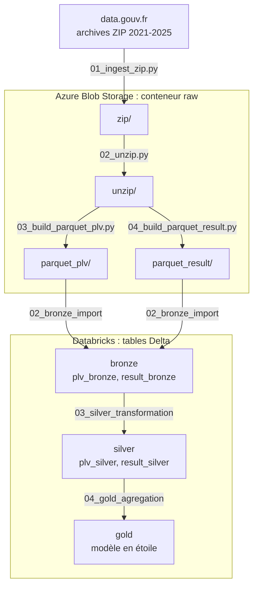
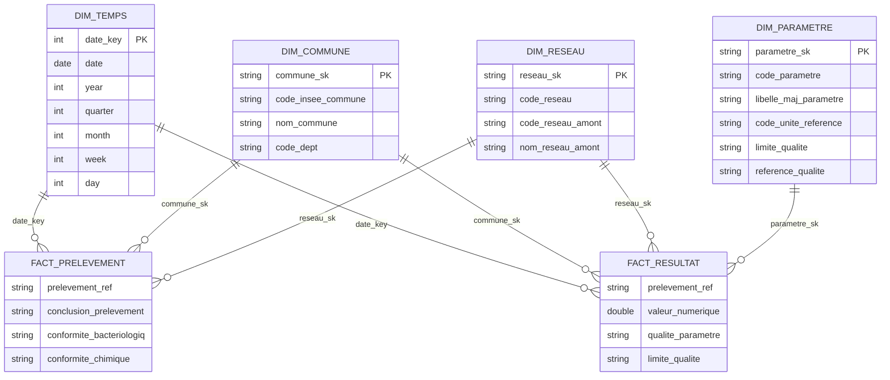

# Qualité de l'eau potable en France

[](https://github.com/Olaffson/brief_qualite_eau_france/actions/workflows/ci.yml)
[](https://github.com/Olaffson/brief_qualite_eau_france/actions/workflows/test.yml)
[](https://codecov.io/gh/Olaffson/brief_qualite_eau_france)
[](LICENSE)

Pipeline de données qui collecte les résultats du **contrôle sanitaire de l'eau potable** en France (2021 à 2025), les stocke dans **Azure** et les transforme avec **Databricks** selon une architecture médaillon (bronze, silver, gold), jusqu'à un modèle en étoile prêt pour l'analyse.

## Sommaire

- [Données sources](#données-sources)
- [Architecture](#architecture)
- [Étapes du pipeline](#étapes-du-pipeline)
- [Modèle de données gold](#modèle-de-données-gold)
- [Structure du dépôt](#structure-du-dépôt)
- [Prérequis et configuration](#prérequis-et-configuration)
- [Lancer le pipeline](#lancer-le-pipeline)
- [Tests et qualité](#tests-et-qualité)
- [Versions](#versions)

## Données sources

Jeu de données du ministère de la Santé publié sur data.gouv.fr : [Résultats du contrôle sanitaire de l'eau distribuée commune par commune](https://www.data.gouv.fr/fr/datasets/resultats-du-controle-sanitaire-de-leau-distribuee-commune-par-commune/).

Une archive ZIP par année (2021 à 2025) contient, pour chaque département, deux types de fichiers texte :

| Fichier | Contenu | Une ligne par |
|---|---|---|
| `DIS_PLV*.txt` | Prélèvements : commune, réseau de distribution, date, conclusion et conformités bactériologique et chimique | prélèvement |
| `DIS_RESULT*.txt` | Résultats d'analyse : paramètre mesuré, résultat, unité, limite et référence de qualité | paramètre analysé dans un prélèvement |

## Architecture



- **Ingestion** (scripts Python exécutés par GitHub Actions) : téléchargement des archives, décompression et assemblage d'un fichier Parquet par année et par type de fichier, dans le conteneur `raw`.
- **Transformation** (notebooks Databricks orchestrés par un job) : tables Delta enregistrées dans le metastore Hive (`hive_metastore.bronze`, `.silver`, `.gold`), stockées dans les conteneurs `bronze`, `silver` et `gold` du même compte de stockage.

## Étapes du pipeline

| Étape | Fichier | Rôle |
|---|---|---|
| 1. Téléchargement | `notebooks/01_ingest_qualite_eau/01_ingest_zip.py` | Télécharge les archives de data.gouv.fr vers `raw/zip/`. Une archive déjà présente n'est pas retéléchargée. |
| 2. Décompression | `notebooks/01_ingest_qualite_eau/02_unzip.py` | Extrait chaque archive dans `raw/unzip/<archive>/`. Un fichier `_SUCCESS` marque les archives déjà traitées. |
| 3. Parquet des prélèvements | `notebooks/01_ingest_qualite_eau/03_build_parquet_plv.py` | Assemble les fichiers `DIS_PLV` de chaque année dans `raw/parquet_plv/dis-plv-<année>.parquet` (encodage et séparateur détectés automatiquement). |
| 4. Parquet des résultats | `notebooks/01_ingest_qualite_eau/04_build_parquet_result.py` | Assemble les fichiers `DIS_RESULT` de chaque année dans `raw/parquet_result/dis_result_<année>.parquet`. |
| 5. Bronze | `notebooks/02_bronze_import.ipynb` | Réunit les années dans les tables `bronze.plv_bronze` et `bronze.result_bronze`, sans transformation. |
| 6. Silver | `notebooks/03_silver_transformation.ipynb` | Renomme les colonnes en noms explicites (`cdreseau` → `code_reseau`…), supprime les espaces superflus et convertit l'année en entier. |
| 7. Gold | `notebooks/04_gold_agregation.ipynb` | Construit les dimensions et les tables de faits du modèle en étoile. |

Les étapes 3 et 4 ajoutent deux colonnes de traçabilité : le fichier d'origine (`source` en silver) et l'année (`annee`).

## Modèle de données gold



| Table | Grain | Clé |
|---|---|---|
| `gold.dim_temps` | une date de prélèvement | `date_key` (AAAAMMJJ) |
| `gold.dim_commune` | une commune | `commune_sk` : empreinte SHA-256 du code INSEE, du nom et du département |
| `gold.dim_reseau` | un réseau de distribution | `reseau_sk` : empreinte SHA-256 du réseau et de son réseau amont |
| `gold.dim_parametre` | un paramètre analysé et son unité | `parametre_sk` : empreinte SHA-256 du code, de l'unité et du libellé |
| `gold.fact_prelevement` | un prélèvement | `prelevement_ref` |
| `gold.fact_resultat` | un résultat de paramètre dans un prélèvement | `prelevement_ref` + `parametre_sk` |

Les clés de substitution sont des empreintes (hash) : elles restent identiques d'une exécution à l'autre du pipeline.

## Structure du dépôt

```
├── .github/workflows/
│   ├── ci.yml                  # ingestion puis job Databricks
│   ├── test.yml                # lint, formatage, tests et couverture
│   └── release.yml             # versions et notes de version automatiques
├── config/
│   └── pipeline_config.json    # définition du job Databricks (bronze → silver → gold)
├── notebooks/
│   ├── 01_ingest_qualite_eau/  # scripts d'ingestion vers Azure (étapes 1 à 4)
│   ├── 02_bronze_import.ipynb
│   ├── 03_silver_transformation.ipynb
│   ├── 04_gold_agregation.ipynb
│   └── 05_quality_check.py     # contrôles de qualité (à écrire)
├── tests/                      # tests d'intégration Azure, Databricks et gold
├── codecov.yml                 # objectif de couverture de tests (50 %)
└── .semantic-release.toml      # configuration de python-semantic-release
```

## Prérequis et configuration

### Azure

Un compte de stockage (Data Lake Storage Gen2) avec quatre conteneurs : `raw`, `bronze`, `silver` et `gold`.

### Databricks

- Un cluster dont les variables d'environnement contiennent `STORAGE_ACCOUNT_NAME` et `STORAGE_ACCOUNT_KEY` : les notebooks s'en servent pour accéder au compte de stockage.
- Les notebooks importés dans l'espace de travail.
- `config/pipeline_config.json` adapté à votre espace : identifiant du cluster (`existing_cluster_id`) et chemins des notebooks (`notebook_path`).

### Secrets GitHub

Dans **Settings → Secrets and variables → Actions** :

| Secret | Utilisé par |
|---|---|
| `AZURE_STORAGE_CONNECTION_STRING` | scripts d'ingestion, tests d'intégration |
| `DATABRICKS_HOST` | création et lancement du job Databricks, tests d'intégration |
| `DATABRICKS_TOKEN` | création et lancement du job Databricks, tests d'intégration |
| `DATABRICKS_HTTP_PATH` *(facultatif)* | test de connexion à un SQL Warehouse |

## Lancer le pipeline

### Avec GitHub Actions

**Actions → CI → Run workflow** lance les deux jobs :

1. `run-ingest` : les quatre scripts d'ingestion, vers le conteneur `raw` ;
2. `run-pipeline` : crée le job Databricks décrit dans `config/pipeline_config.json` (ou le met à jour s'il existe déjà), puis le lance. Le lien vers l'exécution s'affiche dans les journaux.

### En local (ingestion uniquement)

```bash
cd notebooks/01_ingest_qualite_eau
pip install -r requirements.txt
export AZURE_STORAGE_CONNECTION_STRING="<chaîne de connexion du compte de stockage>"

python 01_ingest_zip.py
python 02_unzip.py
python 03_build_parquet_plv.py
python 04_build_parquet_result.py
```

Chaque script saute ce qui a déjà été fait (archives téléchargées, archives décompressées, Parquet existants) : il peut être relancé sans risque.

## Tests et qualité

Le workflow **Tests** (lancement manuel) :

- vérifie le code avec **ruff** et son formatage avec **black** ;
- lance les tests avec **pytest** et mesure la couverture, avec un minimum de 50 %, envoyée à Codecov ;
- lance les tests marqués `integration` si les secrets Azure et Databricks sont configurés : accès au conteneur `raw`, connexion à Databricks SQL, unicité des clés et cohérence des clés étrangères du modèle gold.

## Versions

À chaque modification de `main`, le workflow **Release** utilise [python-semantic-release](https://python-semantic-release.readthedocs.io/) pour calculer le numéro de version à partir des messages de commit et publier une release GitHub. Les messages doivent donc suivre la convention [Conventional Commits](https://www.conventionalcommits.org/fr/) :

| Préfixe | Effet |
|---|---|
| `fix: ...` | version corrective (0.1.0 → 0.1.1) |
| `feat: ...` | nouvelle version mineure (0.1.0 → 0.2.0) |
| `refactor:`, `style:`, `docs:`, `test:`... | pas de nouvelle version |

## Licence

Projet sous licence MIT, voir [LICENSE](LICENSE).
